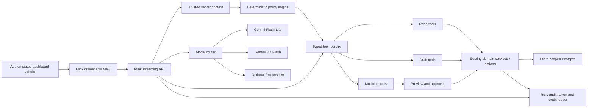

# Mink AI Dashboard Agent — Architecture and Delivery Plan

> **Status:** Phase 1B of the read-only internal alpha is implemented behind a
> disabled-by-default server flag. It is not enabled for merchants and remains
> far narrower than the complete product described in this plan. Migration
> `20260829_0038_mink_phase_1b` and the live evaluation gate must pass in the
> target environment before an invited beta decision.
>
> **Plan date:** 2026-08-29
>
> **Platform constraint:** Mink AI must run on Google Cloud Vertex AI / Gemini
> Enterprise Agent Platform. OpenAI models are out of scope.

### Implementation checkpoint — 2026-08-29

The current Phase 0/1 foundation slice now includes:

- the official `@google/genai` SDK pinned to the supported 2.x line;
- a Vertex-only Gemini 3.7 Flash client using ADC, the stable `v1` API,
  low-level thinking and SDK-managed chat history/thought signatures;
- trusted actor construction from the authenticated host, admin, database role,
  permissions and effective plan;
- a permission-filtered tool registry that rechecks authorization at execution;
- five explicitly store-scoped read tools: `get_store_profile`,
  `get_catalog_summary`, `search_products`, `get_sales_summary` and
  `list_low_stock`; sales reuse the dashboard's recognized-order, refund,
  timezone and location contract, while stock intersects exact location names
  with trusted admin assignments and uses per-SKU thresholds;
- a bounded multi-step orchestration loop with step, tool and parallel-read
  limits;
- an authenticated, same-origin, rate-limited SSE endpoint at
  `POST /api/mink/stream` with an abort-aware Vertex session;
- service-only, RLS-enabled persistent conversations, runs, successful-turn
  history, redacted tool telemetry and an append-only raw token ledger;
- an abortable streaming client integrated with the existing Home prompt,
  drawer and expanded view, with tool progress, Stop, Retry and safe errors;
- a store/admin-scoped ten-conversation sidebar that restores the newest
  successful transcript after refresh, supports confirmed deletion, and
  atomically removes the oldest thread when an eleventh is created;
- a resizable side panel with a browser-local width preference, the same purple
  robot identity as Help Centre Mink, an auto-growing multiline composer, and
  safe emphasis/inline-code rendering without raw HTML;
- a separate published Help Centre guide for the dashboard alpha's supported
  questions, permission behavior, privacy and limits;
- prompt-injection instructions that treat all tool values as untrusted data;
- one abort-aware retry for transient model failures, bounded tool timeouts, a
  hard run timeout and safe public errors while details remain in server logs;
- complete/partial/unavailable usage states with a versioned micro-USD Gemini
  3.7 Flash shadow estimate (unknown usage is never presented as free);
- a page-gated operator inspector at `/dashboard/mink` for redacted status,
  latency, retries, tool names, tokens and cost—never conversation content or
  provider reasoning;
- a 50-case live evaluation corpus and `npm run mink:eval` gate for tool choice,
  security refusals, malformed calls, latency and manual grounding review; and
- focused tests for config fail-closed behavior, actor construction,
  authorization/permission matrices, location scope, tenant-free tool schemas,
  retry/cost logic, agent limits, operator filters and the SSE boundary.

The dev deployment has also passed manual acceptance for ten-conversation
history, conversation deletion, panel resizing, multiline input growth and
cross-tenant isolation. These checks validate the internal-alpha UX/security
slice; they do not replace the evaluation and production-readiness gates below.

The real client and endpoint remain unreachable unless
`MINK_AI_ENABLED=true`; the disabled state still returns the existing canned
coming-soon response. The current build does not charge credits, stream token
deltas, or provide order, customer, Help Centre, coding or mutation tools. The
50 cases are the first comparison set, not the complete 200-case Phase 0
corpus, and have not yet been executed against both live models in a controlled
store. Production invitation controls and the merchant feedback/PII work
required to leave internal alpha are also absent. Those are remaining work,
not implied capability.

## 1. Executive decision

Build Mink AI as a **permission-aware operating agent for each StoreMink
merchant**, not as an unrestricted chatbot and not as a model with direct
database access.

The production model strategy is:

| Workload                                                                                   | Model                            | Thinking                                      | Launch status            | Decision                                                                           |
| ------------------------------------------------------------------------------------------ | -------------------------------- | --------------------------------------------- | ------------------------ | ---------------------------------------------------------------------------------- |
| Intent routing, summarisation, low-cost classification                                     | `gemini-3.1-flash-lite`          | Lowest supported setting                      | GA                       | Use for high-volume, low-risk model work                                           |
| Normal business questions, analysis, tool selection, multi-step actions, storefront coding | `gemini-3.7-flash`               | `LOW` or `MEDIUM`; `HIGH` only when justified | GA                       | **Primary Mink AI model**                                                          |
| Exceptionally difficult planning or reasoning                                              | `gemini-3.1-pro-preview`         | `HIGH`                                        | Preview                  | Evaluation-only escalation behind an operator flag; never a launch dependency      |
| Existing Help Centre answers, copy generation and brand-voice features                     | Existing `gemini-2.5-flash` path | Existing configuration                        | Existing production path | Keep unchanged initially; migrate only through a separate regression-tested change |
| Help Centre embeddings                                                                     | Existing `gemini-embedding-001`  | N/A                                           | Existing production path | Keep the current 768-dimensional storage contract                                  |

Google describes Gemini 3.7 Flash as the Gemini 3 family's primary agentic
workhorse, with a 1,048,576-token context window, function calling, structured
output, code execution, context caching and a GA production release. It is the
right default for Mink AI. `gemini-3.1-pro-preview` is useful for benchmarking
hard cases, but a Preview model must not be required for a reliable customer
workflow.

Sources:

- [Gemini 3.7 Flash developer guide](https://docs.cloud.google.com/gemini-enterprise-agent-platform/models/guides/gemini-3-7-flash)
- [Gemini 3.7 Flash model reference](https://docs.cloud.google.com/gemini-enterprise-agent-platform/models/gemini/3-7-flash)
- [Vertex / Agent Platform function calling](https://docs.cloud.google.com/gemini-enterprise-agent-platform/models/tools/function-calling)
- [Gemini thought signatures](https://docs.cloud.google.com/gemini-enterprise-agent-platform/models/thinking/thought-signatures)
- [Google model pricing](https://cloud.google.com/gemini-enterprise-agent-platform/generative-ai/pricing)

## 2. Why Gemini 2.5 Flash should not be the dashboard agent

Gemini 2.5 Flash remains suitable for StoreMink's current bounded generation
tasks: one product description, one SEO draft, one coupon email or one grounded
Help answer. Those requests have a narrow prompt, a narrow output and no
meaningful authority.

A dashboard agent has a different job. It must:

- understand an ambiguous business request;
- select the correct StoreMink tools;
- respect the current admin's section permissions;
- preserve reasoning state across several tool calls;
- distinguish reading, proposing and changing;
- recover from partial failures without repeating mutations;
- maintain exact tenant boundaries;
- explain what it found and what it changed;
- stop for approval before a material action;
- and sometimes generate or validate storefront code.

The dashboard agent therefore gets its own runtime and model configuration. Do
not replace `GEMINI_MODEL` globally and accidentally migrate product copy, Help
generation and the new agent in one release.

## 3. Product promise and boundaries

### 3.1 Product promise

Mink AI should eventually be able to:

1. Answer questions using the merchant's live StoreMink data.
2. Explain results, trends and anomalies in plain language.
3. Draft products, pages, campaigns, blogs and operating plans.
4. Propose changes with a clear preview and impact summary.
5. Perform authorized StoreMink actions after the required approval.
6. Run long, multi-step workflows with progress, checkpoints and recovery.
7. Proactively identify useful opportunities and problems.
8. Generate and revise storefront custom-code sections in a safe preview.

### 3.2 Permanent boundaries

Merchant-facing Mink AI must never:

- receive a raw SQL, database, shell or generic server-action tool;
- accept `store_id`, admin identity or permissions from model-generated input;
- read another store, even when a user includes another store ID in a prompt;
- reveal secrets, payment credentials, session cookies or one-time codes;
- silently send a campaign, publish content, refund money, delete data, change
  staff access or alter billing;
- modify StoreMink's platform source repository or deploy StoreMink itself;
- treat a model-generated statement as evidence that an action succeeded;
- or claim a capability when the corresponding tool does not exist.

“Capable of everything” means broad coverage through reviewed StoreMink tools.
It cannot mean unlimited authority.

## 4. Current StoreMink foundation

The implementation should extend the current platform rather than create an
unrelated second system:

- `app/dashboard/dashboard-chat.tsx` already provides side-panel and expanded
  conversation surfaces.
- `app/dashboard/mink-ai.ts` selects the canned response while the server flag
  is off and the abortable SSE client while it is on.
- `app/dashboard/chat-context.tsx` already shares one conversation between the
  Home prompt and the dashboard drawer.
- `lib/ai/gemini.ts` already proves Vertex ADC calls from Cloud Run and emits
  latency/token telemetry, but its raw Gemini 2.5 request contract is not the
  new agent runtime.
- `lib/ai/brand-voice.ts` supplies per-store voice.
- `lib/ai/quota.ts`, `ai_usage`, the AI credit balance and append-only credit
  ledger provide a metering and purchase foundation.
- `app/dashboard/lib/access.ts` and `permissions.ts` are the authoritative
  merchant RBAC layer.
- `activity_events` and `recordEvent` provide the existing audit stream.
- `lib/help/` provides grounded Help retrieval and should become one read-only
  dashboard tool rather than being reimplemented.
- The Website Builder already has sandboxed custom-code sections, preview,
  CodeMirror, autosave and history primitives.

## 5. Recommended runtime architecture



### 5.1 Runtime decision

For Phases 0–5, run the TypeScript orchestrator in StoreMink's existing Cloud
Run application, using the official Google Gen AI SDK with Vertex enabled.
This keeps authorization, domain transactions and tenant context close to the
existing code and avoids introducing a second Python runtime before the tool
contracts are stable.

Evaluate managed Agent Runtime later for durable specialist agents or isolated
long-running workloads. Google supports TypeScript through a custom container
or Cloud Run, but adopting managed Agent Runtime is not required to make the
first agent reliable.

### 5.2 New model client

Create an agent-specific client instead of expanding the current raw
`callGemini` function into an incompatible abstraction.

Suggested configuration:

```text
MINK_VERTEX_MODEL=gemini-3.7-flash
MINK_VERTEX_FAST_MODEL=gemini-3.1-flash-lite
MINK_VERTEX_DEEP_MODEL=gemini-3.1-pro-preview
MINK_VERTEX_DEEP_ENABLED=false
MINK_VERTEX_LOCATION=global
MINK_MAX_STEPS_PER_RUN=12
MINK_MAX_PARALLEL_READ_TOOLS=4
MINK_RUN_TIMEOUT_SECONDS=120
```

Production authentication remains Application Default Credentials from the
Cloud Run service account. No API key is exposed to the browser.

The Gemini 3 contract differs from the current Gemini 2.5 payload:

- use `thinking_level`, not the current integer `thinkingBudget`;
- do not rely on `temperature`, `top_k` or `top_p` for Gemini 3.7 Flash;
- use strict JSON schemas and strict function-call/result matching;
- preserve opaque thought signatures across multi-step turns;
- preserve the full provider response parts or let the official SDK manage the
  history so tool reasoning does not break with a `400` error;
- cap model steps, tool calls, input rows and output size at the application
  layer even though the model supports a very large context window.

### 5.3 Do not use the million-token window as storage

The 1M context window is a capability, not a reason to send the entire store to
the model. Mink should retrieve the smallest useful, permission-filtered set of
facts. Large unfiltered prompts increase cost, latency, privacy risk and prompt
injection exposure.

## 6. Trusted context and tenancy

Every run begins with a server-created `MinkActorContext`:

```ts
interface MinkActorContext {
  storeId: string;
  adminId: string;
  email: string | null;
  roleId: string | null;
  permissions: Record<string, { view: boolean; manage: boolean }>;
  effectivePlan: "free" | "basic" | "pro";
  currentPath: string;
  selectedResource?: { type: string; id: string };
  requestId: string;
}
```

Rules:

1. This object is constructed after dashboard authentication and database role
   resolution.
2. It is never accepted from the browser as authoritative.
3. `storeId` and `adminId` are never function parameters exposed to Gemini.
4. Every tool receives this context out of band.
5. Every read and write explicitly scopes by `storeId` even where RLS also
   protects the table.
6. A permission read failure is an outage, not “no access.”
7. Service-role database access is used only when necessary and only after the
   tool has validated tenant, permission and arguments.

## 7. Tool system

### 7.1 Tool definition contract

Every tool should declare:

```ts
interface MinkToolDefinition<Input, Output> {
  name: string;
  version: number;
  description: string;
  inputSchema: unknown;
  outputSchema: unknown;
  risk: "read" | "draft" | "write" | "high_risk" | "forbidden";
  permission: { section: string; action: "view" | "manage" };
  minPlan?: "free" | "basic" | "pro";
  approval: "none" | "inline" | "explicit" | "fresh_auth";
  timeoutMs: number;
  maxCallsPerRun: number;
  pii: "none" | "masked" | "allowed";
  idempotent: boolean;
  execute(context: MinkActorContext, input: Input): Promise<Output>;
}
```

Additional invariants:

- Tools return bounded structured JSON, never a database object or arbitrary
  HTML.
- Tool descriptions explain side effects and failure states.
- Validation happens before any external call or transaction.
- A tool result distinguishes `success`, `declined`, `not_found`, `conflict`,
  `unavailable` and `unknown_outcome`.
- An unknown external payment or shipping outcome is never converted to a
  failure or success by the model.
- Parallel calls are allowed only for read tools.
- A mutation tool cannot call another mutation tool invisibly.

### 7.2 Initial read tools

- `get_store_overview`
- `get_sales_summary`
- `compare_sales_periods`
- `list_recent_orders`
- `get_order_detail`
- `list_low_stock`
- `get_inventory_position`
- `get_product_detail`
- `list_top_products`
- `get_customer_summary`
- `list_customer_segments`
- `get_campaign_performance`
- `get_search_performance`
- `find_help_guides`
- `get_current_page_context`

Each answer derived from business data must include the date range, currency,
store/location scope, data freshness and links to the relevant dashboard view.

### 7.3 Draft tools

- `draft_product_copy`
- `draft_product_seo`
- `draft_blog_post`
- `draft_coupon_campaign`
- `draft_customer_message`
- `propose_price_changes`
- `propose_inventory_adjustments`
- `propose_customer_group`
- `propose_navigation_changes`
- `propose_builder_section`

Draft tools do not publish and do not require the model to pretend that a draft
has been applied.

### 7.4 Mutation tools

Introduce one domain at a time:

- `create_product_draft`
- `update_product_fields`
- `adjust_inventory_at_location`
- `create_coupon_draft`
- `save_customer_group`
- `schedule_blog_publish`
- `save_navigation_draft`
- `save_builder_section_draft`
- `publish_approved_builder_version`

Later, after domain-specific acceptance testing:

- `update_order_status`
- `schedule_campaign_send`
- `bulk_update_prices`
- `bulk_adjust_inventory`
- `prepare_refund_request`

Refund execution, staff roles, plan/billing changes, payment credentials,
domain ownership, store deletion and arbitrary exports remain unavailable until
a separate threat model explicitly authorizes them. Some should remain
permanently manual.

## 8. Approval and risk model

| Tier                | Examples                                                                                 | Required behavior                                                                                              |
| ------------------- | ---------------------------------------------------------------------------------------- | -------------------------------------------------------------------------------------------------------------- |
| R0 — read           | Metrics, lists, explanations, navigation                                                 | Execute without confirmation if the user has `view` permission                                                 |
| R1 — draft          | Copy, report, proposed group, unpublished section                                        | May create a reversible draft; clearly label it as a draft                                                     |
| R2 — material write | Product edit, inventory adjustment, coupon creation                                      | Render exact before/after preview; explicit confirmation bound to exact arguments                              |
| R3 — high risk      | Bulk prices, campaign send, publish, order state, refund preparation                     | Owner/authorized manager, fresh data read, impact summary, explicit confirmation; fresh auth where appropriate |
| R4 — prohibited     | Secrets, raw SQL, staff escalation, billing credentials, store deletion, platform deploy | Do not expose a tool                                                                                           |

An approval record must be bound to a hash of:

- tool name and version;
- normalized arguments;
- store and actor;
- records and versions read for the preview;
- quoted financial/customer impact;
- and expiration time.

If any input changes after approval, the approval is invalid and a new preview
is required. “Yes” in an unrelated later conversation must never approve a
stale action.

## 9. Proposed persistence model

All new tenant data requires `store_id`, indexes and RLS. Use forward-only
migrations.

### `mink_conversations`

- `id`
- `store_id`
- `admin_id`
- `title`
- `status` (`active`, `archived`, `deleted`)
- `last_message_at`
- `expires_at`
- timestamps

### `mink_messages`

- `id`
- `store_id`
- `conversation_id`
- `run_id`
- `role`
- `content_json`
- `provider_state_json` for opaque Gemini parts/thought signatures
- `model`
- `created_at`

Never parse, display or log opaque thought-signature contents.

The alpha schema creates this field for future opaque provider-state replay but
currently persists only final user/assistant text. Within a live run the
official SDK owns the exact function-call parts and thought signatures.

### `mink_runs`

- `id`
- `store_id`
- `conversation_id`
- `requested_by`
- `status` (`queued`, `running`, `waiting_approval`, `succeeded`, `failed`,
  `cancelled`, `unknown_outcome`)
- `model`, `thinking_level`, prompt/tool registry versions
- `risk_tier`
- input/output/cached/thinking token counts
- estimated provider cost and charged credits
- latency, step count, error code
- idempotency key and timestamps

The alpha implements the `running`, `succeeded`, `failed` and `cancelled`
subset plus token counts, steps, tools, latency and error code. Queuing,
approval pauses, unknown external outcomes, cost estimates and idempotent
mutation fields arrive with the relevant later phases.

### `mink_tool_calls`

- run and sequence IDs
- tool name/version
- redacted arguments and bounded result summary
- status and risk
- permission checked
- approval ID
- idempotency key
- started/completed timestamps and error code

### `mink_approvals`

- run/tool call/store/actor IDs
- action hash
- preview JSON
- status (`pending`, `approved`, `rejected`, `expired`, `consumed`)
- expiry and resolution timestamps

### `mink_usage_ledger`

Append-only record of model, tokens, provider-cost estimate, tool cost, reserved
credits, final credits and reversal. This should become the source of truth for
Mink usage rather than inferring cost from chat messages.

The alpha ledger records raw token counts and zero charged credits. Provider
cost estimates, reservations, reconciliation and reversals are intentionally
not active until pilot distributions are measured.

### `mink_memories` — not before the proactive phase

Only store explicit, user-approved business preferences. Do not create inferred
long-term memory from customer data, private messages or credentials.

## 10. Conversation and streaming protocol

Target protocol:

1. The browser sends the message, current route and optional selected record.
2. The server reconstructs identity, tenant and permissions.
3. The server creates a run and reserves a bounded number of credits.
4. The router selects model and thinking level.
5. The server streams typed events:
   - `message_delta`
   - `status`
   - `tool_started`
   - `tool_completed`
   - `approval_required`
   - `usage`
   - `completed`
   - `failed`
6. Tool calls loop through deterministic validation and policy checks.
7. Opaque provider parts and thought signatures are replayed exactly.
8. Final usage reconciles the reservation; unused credits are released.
9. The UI renders facts, sources, planned actions and completed actions as
   separate visual blocks.

The flag-enabled `useMinkAi` path now uses an abortable streaming client;
closing the drawer does not cancel a run, while explicit Stop does. The
flag-disabled path deliberately retains the timed canned response.

The current alpha implements the abortable transport with coarser
`status`/`tool`/`message`/`usage`/`done` events and one final assistant message.
It creates and commits the run before returning completion, retains the newest
ten conversations per actor/store, restores the latest thread after refresh,
and treats explicit Stop as cancellation. Delta rendering, background
continuation and approval-required events remain later work.

## 11. Model routing policy

Model selection is application policy, not model choice.

### Flash-Lite

Use for:

- title generation;
- topic/risk classification;
- summarising already-grounded tool results;
- extracting structured filters from a simple request;
- and low-risk Help/navigation questions.

Flash-Lite never directly authorizes a mutation.

### Gemini 3.7 Flash

Use as the normal agent for:

- business questions requiring several reads;
- analytics interpretation;
- tool selection;
- proposal generation;
- mutation planning and post-approval execution;
- long workflows;
- and storefront code generation/revision.

Default `thinking_level`:

- `LOW`: simple question, one read tool, short result;
- `MEDIUM`: ordinary analysis, tool workflow or action proposal;
- `HIGH`: hard anomaly analysis, complex code or a workflow that failed its
  first plan.

Do not retry by increasing thinking indefinitely. One controlled escalation is
the maximum.

### Gemini 3.1 Pro Preview

Use only when all of the following are true:

- the operator flag is enabled;
- the store/plan is eligible;
- the run is non-critical or still requires human approval;
- 3.7 Flash evaluation has shown a real quality gap;
- and the customer-visible workflow has a 3.7 Flash fallback.

Never use Preview Pro as the sole model capable of completing a paid feature.

## 12. Cost and credit model

### 12.1 Provider pricing baseline

As of the plan date, Google lists these global standard prices per one million
tokens:

| Model                  | Input | Cached input | Output/reasoning | Pricing note                            |
| ---------------------- | ----: | -----------: | ---------------: | --------------------------------------- |
| Gemini 3.1 Flash-Lite  | $0.25 |       $0.025 |            $1.50 | Cost-sensitive routing model            |
| Gemini 3.7 Flash       | $0.75 |       $0.075 |            $3.75 | Introductory pricing through 2026-12-31 |
| Gemini 3.7 Flash       | $1.50 |        $0.15 |            $7.50 | Published price from 2027-01-01         |
| Gemini 3.1 Pro Preview | $2.00 |        $0.20 |           $12.00 | Up to 200K input tokens                 |

Price the StoreMink product against the **post-promotion 3.7 price**, not the
temporary 2026 discount. For input contexts above 200K, Google applies the
published long-context rate to the whole request. Keep normal Mink runs far
below this threshold.

At a planning conversion of ₹90/USD:

| Example                                          | Raw model cost now | Post-promotion planning cost |
| ------------------------------------------------ | -----------------: | ---------------------------: |
| Flash-Lite quick task: 4K input + 500 output     |              ₹0.16 |                        ₹0.16 |
| 3.7 normal agent task: 12K input + 2K output     |              ₹1.49 |                        ₹2.97 |
| 3.7 substantial code task: 50K input + 8K output |              ₹6.08 |                       ₹12.15 |
| Pro Preview hard task: 12K input + 2K output     |              ₹4.32 |                        ₹4.32 |

Add a 30–40% operating buffer for retries, Cloud Run, database queries,
storage, observability, taxes, payment fees and support.

Google Search grounding includes a shared free allowance and is then priced per
grounding query. It must be opt-in for a user request that needs current public
information; StoreMink business questions should use StoreMink data instead.

### 12.2 Credits

Keep one existing credit equal to one existing lightweight generation so past
buyers do not lose value. Agent tasks spend a documented weighted number of
credits:

| Work                                 |                         Initial debit |
| ------------------------------------ | ------------------------------------: |
| Flash-Lite lookup or classification  |                              1 credit |
| 3.7 business analysis                |                             3 credits |
| 3.7 material action through approval |                             5 credits |
| Pro/deep reasoning escalation        |                             8 credits |
| Google Search grounding              |        +2 credits per grounding query |
| Moderate storefront coding run       |                            20 credits |
| Large coding run                     | Quote a capped amount before starting |

These are launch hypotheses. Phase 1 records shadow usage without charging;
Phase 2 compares estimated and real costs; live weights are set only after the
evaluation and pilot distribution is known.

The current 25/₹59, 60/₹129 and 150/₹299 packs can remain initially. Add an
atomic `try_spend_ai_credits(p_store, p_amount, p_ref)` operation rather than
looping the single-credit RPC. One run reserves its maximum charge, then
reconciles or reverses it exactly once.

Do not sell unlimited agent use.

## 13. Delivery phases

The estimates assume two full-stack engineers, one AI/backend engineer,
product/design participation and regular QA/security support. A smaller team
should expect a longer calendar duration.

### Phase 0 — Threat model, evaluation set and architecture skeleton

**Duration:** 2–3 weeks

Deliver:

- finalize allowed, approval-required and forbidden actions;
- write the tenant-isolation and prompt-injection threat model;
- create at least 200 representative StoreMink prompts and expected outcomes;
- define the tool, run, approval, streaming and error contracts;
- create the model-router and cost-estimation specifications;
- add operator kill switches for the whole agent, each model and every mutation
  tool;
- establish per-store, per-user and platform spend/rate limits;
- define retention and deletion policy;
- prototype Gemini 3.7 Flash with five read tools in a non-customer harness.

Exit criteria:

- every proposed tool has an owner and risk classification;
- every mutation has an approval story and idempotency design;
- the evaluation harness reports tool choice, answer quality, permissions,
  latency, tokens and estimated cost;
- and no implementation depends on Pro Preview.

### Phase 1 — Agent runtime and read-only internal alpha

**Duration:** 3–4 weeks

Deliver:

- Google Gen AI SDK Vertex client and model router;
- persistent conversations, runs, messages and usage records;
- exact thought-signature preservation;
- streaming client integrated with the existing Mink drawer/full view;
- trusted actor context and permission-aware tool filtering;
- initial read tool registry;
- citations/deep links to dashboard records;
- cancellation, timeouts, bounded retries and friendly error states;
- token/cost dashboards and run-level tracing;
- no customer billing.

Example alpha questions:

- “How much did I sell today versus last Friday?”
- “Which five products are closest to running out at this location?”
- “Why is this order still waiting?”
- “Which products produced the most gross margin this month?”
- “Where do I configure pickup?”

Exit criteria:

- zero cross-tenant access in automated adversarial tests;
- 100% of unavailable tools are absent from the model manifest;
- at least 90% grounded-answer correctness on the alpha evaluation set;
- no invented order, product, customer or metric identifiers;
- p95 ordinary-response latency target under 8 seconds;
- and malformed tool calls under 1% on the test distribution.

### Phase 2 — Read-only merchant beta and grounded analytics

**Duration:** 3–4 weeks

Deliver:

- invited-store feature flag;
- rich answer cards for metrics, orders, products and inventory;
- date/location/channel filters extracted and then shown back to the user;
- current-page and selected-record context;
- Help Centre hybrid retrieval as a tool;
- follow-up conversations with compaction/summarisation thresholds;
- thumbs-up/down, issue reporting and trace correlation;
- shadow credit metering and cost cohorts;
- PII minimization and role-specific masking.

Exit criteria:

- no severity-one security or tenancy findings;
- 95% of quantitative answers expose scope and period;
- the model refuses or clarifies underspecified high-impact questions;
- support can inspect a redacted trace without seeing provider reasoning;
- and pilot cost distributions are stable enough to set credit weights.

### Phase 3 — Drafting and reversible work

**Duration:** 3–5 weeks

Deliver:

- product, SEO, blog, coupon-email and customer-message drafts;
- per-store brand voice in agent generation;
- proposal cards with before/after previews;
- save-as-draft tools only;
- draft versioning and rollback;
- plan/credit UI with expected cost before a substantial run;
- live weighted credits for opted-in beta stores.

Exit criteria:

- nothing produced in this phase can become public or contact a customer
  without a separate user action;
- all drafts identify their destination and remain editable;
- failed writes never appear as successful;
- and existing Gemini 2.5 generation features pass unchanged regression tests.

### Phase 4 — Guarded single-domain actions

**Duration:** 5–6 weeks

Start with Products because StoreMink already has mature CRUD, permissions,
events, plan limits and full-page editing.

Deliver:

- exact change preview;
- approval records bound to arguments and row versions;
- idempotent product create/update tools;
- transaction and conflict handling;
- append-only agent audit entries attributed to the approving admin;
- result cards linking to changed records;
- rollback where safe;
- then repeat the pattern for coupons and customer groups.

Exit criteria for each domain:

- 100% of mutations require `manage` permission;
- an approval cannot be replayed, altered or moved to another store;
- concurrent edits produce a conflict and new preview;
- duplicate delivery/retry cannot repeat the mutation;
- audit records capture proposer, approver, tool version and outcome;
- and domain-specific acceptance tests pass before the next domain is enabled.

### Phase 5 — Inventory, orders, publishing and campaigns

**Duration:** 5–7 weeks

These domains have physical, customer or financial consequences and must not be
bundled into Phase 4 merely because the tool interface looks similar.

Deliver in separate gates:

1. inventory proposal and adjustment at one explicit location;
2. bulk inventory with line-by-line preview;
3. order-status proposal and guarded transition;
4. content scheduling and publishing;
5. campaign audience preview, sample, schedule and final send confirmation;
6. bulk price changes with revenue-impact summary.

Exit criteria:

- inventory actions preserve current location and stock invariants;
- order transitions reuse the domain's authoritative lifecycle checks;
- campaign approval includes audience count, sender and schedule;
- bulk actions cap row count and support partial-error reporting;
- and any POS/locations/inventory/fulfilment behavior update is recorded in
  `docs/roadmap.md` and `docs/pos-acceptance.md` in the same implementation.

### Phase 6 — Durable multi-step workflows

**Duration:** 5–7 weeks

Deliver:

- durable queued runs with lease/claim semantics;
- checkpoints and human approval pauses;
- progress events, cancellation and resumption;
- step-level idempotency and bounded compensation;
- background completion notifications;
- workflow templates such as:
  - investigate a revenue decline;
  - prepare a product launch;
  - identify slow inventory and draft a promotion;
  - review delayed pickup orders and prepare communications;
  - create a weekly trading report;
- one planner with specialist tools, not a premature multi-agent network.

Evaluate managed Agent Runtime only here. Move a workflow only if it improves
reliability, isolation or operations enough to justify a second deployment
surface.

Exit criteria:

- a Cloud Run restart does not lose or duplicate a run;
- every external side effect has an idempotency or reconciliation story;
- a waiting approval consumes no model tokens;
- cancelled runs cannot continue mutating;
- and support can reconstruct the full action history.

### Phase 7 — Storefront coding agent

**Duration:** 6–8 weeks

Merchant coding scope is the Website Builder and sandboxed custom-code
sections—not StoreMink platform development.

Deliver:

- builder-context read tools for page, theme, sections and brand tokens;
- code proposal as a patch against one section/version;
- schema validation, size limits and disallowed API checks;
- isolated preview iframe using the existing custom-code sandbox;
- desktop/mobile preview and automated accessibility checks;
- user-visible diff and explanation;
- versioned save, publish approval and one-click rollback;
- Gemini 3.7 Flash `HIGH` for hard code tasks;
- bounded code execution only for validation, never with production secrets or
  database/network credentials.

The merchant agent must not edit StoreMink's Next.js repository. If an internal
StoreMink engineering agent is later built, it must be a separate operator-only
system with isolated worktrees, tests, CI, pull requests and mandatory engineer
review.

Exit criteria:

- generated code cannot escape the existing storefront sandbox;
- the agent never publishes without an approval bound to the previewed version;
- rollback restores the exact previous section;
- automated checks cover mobile layout, browser floor, CSP and unsafe APIs;
- and code tasks stay within their quoted credit cap.

### Phase 8 — Proactive operations and optional specialists

**Duration:** 4–6 weeks for the first release, then ongoing

Deliver:

- daily/weekly executive briefs;
- anomaly monitors for sales, conversion, inventory, returns and failed
  payments;
- user-created “watch this” rules;
- suggested actions ranked by evidence and estimated impact;
- explicit opt-in recurring workflows;
- approved business memories;
- optional voice, screenshot and document input;
- specialist agents only where evaluations show a single planner is the
  bottleneck.

No proactive suggestion can mutate state merely because the user enabled an
alert. Autonomous writes require a separately configured workflow, scope,
limits and approval policy.

## 14. Safety and prompt-injection defenses

Store data is untrusted text. A product title, customer name, blog post, CSV or
Help article can contain instructions designed to control the model.

Required controls:

- label tool results as untrusted data, never instructions;
- exclude secrets before model invocation;
- normalize and bound every tool result;
- keep system/tool policies outside retrieved content;
- deterministic allowlists for tools and parameter ranges;
- deterministic RBAC and plan gates before any semantic policy;
- approval for all material writes;
- Model Armor or equivalent scanning where it proves useful;
- adversarial tests that place injection text in every retrieved domain;
- outbound HTTP allowlists; no arbitrary URL-fetch tool;
- and response redaction before rendering/logging.

Google's Semantic Governance policy engine can later add an intent-alignment
gate, but it is Preview and probabilistic. It is defense in depth, never a
replacement for StoreMink's code-level tenancy, RBAC, validation and approvals.
Start it in dry-run mode if evaluated.

Reference:
[Semantic governance overview](https://docs.cloud.google.com/gemini-enterprise-agent-platform/govern/policies/semantic-governance-overview)

## 15. Evaluation strategy

### 15.1 Golden task set

Maintain versioned cases for:

- business facts and calculations;
- date/channel/location ambiguity;
- permission-denied requests;
- nonexistent records;
- tool failure and timeout;
- mutation preview and approval;
- concurrent edits;
- duplicate requests;
- customer PII handling;
- prompt injection;
- cross-tenant attacks;
- code generation and rollback;
- and cost/latency ceilings.

### 15.2 Evaluation layers

1. **Pure tool tests:** validation, permission, tenant scope, output bounds.
2. **Orchestrator tests:** state machine, retries, approvals, cancellation.
3. **Model replay evaluations:** tool selection and final answer from fixed tool
   results.
4. **Live-model evaluations:** pinned model version/config on a controlled
   dataset.
5. **Adversarial evaluations:** injected records, privilege escalation and data
   exfiltration attempts.
6. **Pilot review:** merchant success, corrections, abandonment and support
   tickets.

### 15.3 Release metrics

- Cross-tenant exposure: **0 tolerated**.
- Unauthorized mutation: **0 tolerated**.
- False success after a failed/unknown tool: **0 tolerated**.
- Correct tool selection: at least 95% on release-critical tasks.
- Grounded quantitative answer: at least 95% with correct scope.
- Malformed function calls: below 1% on the release set.
- Duplicate side effects under retry: 0.
- Ordinary p95 read response: target under 8 seconds.
- Ordinary p95 approved single action: target under 15 seconds.
- Cost/run and credits/run: visible for 100% of model runs.

## 16. Observability and operations

Emit structured telemetry for:

- run, conversation, store and actor pseudonymous IDs;
- model/version/thinking level;
- prompt/tool-registry versions;
- input, cached, output and reasoning token counts;
- model and tool latency;
- proposed/called/denied tool names;
- approval wait and resolution;
- retries and finish reason;
- estimated provider cost and credits;
- safety/validation denial category;
- final status and user feedback.

Never log raw secrets, full customer records, opaque thoughts or unredacted tool
arguments. Use trace sampling for successful low-risk runs and retain complete
redacted traces for errors and mutations.

Operator controls must include:

- global shutdown;
- read-only mode;
- disable one tool/domain;
- disable deep model;
- per-model spend ceiling;
- per-store/user rate and credit ceiling;
- live model/config version;
- failure rate, p95 latency and cost dashboards;
- and a redacted run inspector.

## 17. Rollout and commercial gates

1. Local harness and automated evaluations.
2. StoreMink team dogfood with synthetic/demo stores.
3. Internal read-only alpha on real stores.
4. Five invited merchants, read-only.
5. Twenty-five merchants, drafts enabled.
6. Domain-by-domain action beta.
7. Pro-plan general availability after four stable weeks.
8. Basic-plan inclusion with smaller allowance.
9. Free plan receives a small read-only trial, not agent actions.

Do not market “Mink can run your store” during read-only beta. Capability copy
must match enabled tools for that store, role and phase.

## 18. Documentation obligations during implementation

Every implementation phase must update documentation in the same change:

- update `CODEBASE.md` for new routes, actions, libraries, migrations and
  architecture, and describe newly visible behavior;
- add a forward-only Help Centre content migration for each customer-visible
  phase—never edit an applied migration;
- keep the Help guide aligned with permissions, approval rules, credit use,
  limits, failure states, privacy and troubleshooting;
- update `docs/roadmap.md` and `docs/pos-acceptance.md` whenever Mink changes
  POS, locations, inventory, fulfilment or pickup behavior;
- add acceptance stories before declaring a phase complete;
- and never document a planned tool as available before it ships.

## 19. Proposed implementation map

Names are provisional and should be created only in their owning phase.

```text
app/
  api/mink/stream/route.ts
  actions/mink-actions.ts
  dashboard/
    mink-ai.ts
    dashboard-chat.tsx
    chat-context.tsx
    components/mink/

lib/mink/
  actor-context.ts
  vertex-client.ts
  model-router.ts
  orchestrator.ts
  events.ts
  errors.ts
  policy.ts
  approvals.ts
  metering.ts
  redaction.ts
  tools/
    registry.ts
    types.ts
    read/
    draft/
    products/
    inventory/
    orders/
    marketing/
    builder/

drizzle/migrations/sql/
  <forward-only Mink migrations>
```

Do not create one enormous `mink-actions.ts` containing business logic. Tools
should adapt existing domain services; reusable transaction logic belongs in
the domain, not in the agent wrapper.

## 20. Timeline summary

| Milestone                          | Approximate elapsed time |
| ---------------------------------- | -----------------------: |
| Architecture/evaluation foundation |                   Week 3 |
| Internal read-only alpha           |                   Week 7 |
| Invited read-only merchant beta    |               Week 10–11 |
| Drafting beta                      |               Week 14–16 |
| First guarded product actions      |               Week 20–22 |
| Higher-risk domain actions         |               Week 27–29 |
| Durable workflows                  |               Week 34–36 |
| Storefront coding beta             |               Week 42–44 |
| Proactive operations               |                 Week 48+ |

This is approximately 9–12 months for a robust system with a small dedicated
team. A useful read-only beta can ship in roughly 2–3 months. Compressing the
schedule by combining permissions, writes, workflows and coding into one launch
would move risk into production rather than remove work.

## 21. Immediate next sprint

The next sprint should turn the implemented skeleton into measured internal
evidence, not broaden its authority:

1. Apply migration `20260829_0038_mink_phase_1b` to the controlled staging
   database before deploying code that writes the new telemetry columns.
2. Deploy with `_MINK_MAX_MODEL_RETRIES=1` and
   `_MINK_RUN_TIMEOUT_SECONDS=120`, then smoke-test the sales and low-stock
   tools as an owner, a permission-restricted admin and a location-bound admin.
3. Run the 50 cases through `npm run mink:eval` against Gemini 2.5 Flash and
   Gemini 3.7 Flash on the same representative internal store; preserve the
   redacted reports and manually review every answer-contract case.
4. Fix any cross-tenant, permission, malformed-call or grounding failure before
   expanding the corpus toward the 200-case Phase 0 target. The release gate is
   100% security cases, at least 90% overall, malformed calls under 1% and p95
   ordinary latency under 8 seconds.
5. Reconcile the operator inspector's cost totals with the Vertex billing
   export for the same run window; do not set customer credit weights from the
   temporary introductory rate alone.
6. Add prompt-injection fixtures inside controlled product/location names and
   database/disconnect race tests that a normal live prompt cannot create.
7. Make the documented go/no-go decision for an invited read-only beta. Do not
   add mutation tools in this sprint.

The intended outcome is not “Gemini 3.7 answered impressively.” It is:

> Gemini 3.7 selected the correct bounded tool, the server enforced the correct
> store and permissions, the answer was supported by returned data, and no
> unauthorized state change was possible.
